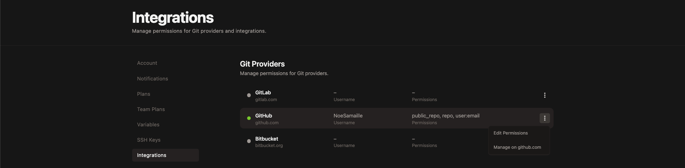
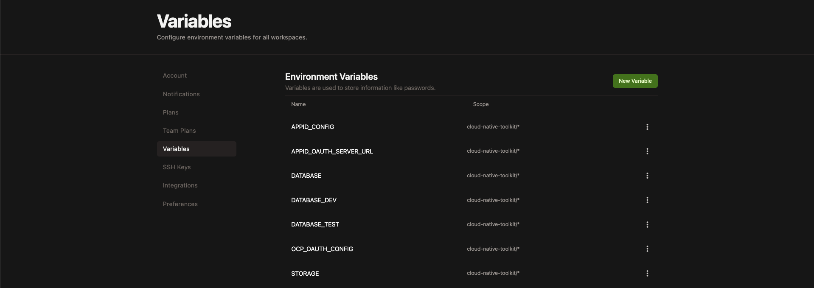

# Ascent UI

This repository contains the Front-End microservice of the Ascent tool (TechZone Deployer - Builder).

Ascent is a tool created by the IBM Ecosystem Engineering team to accelerate the adoption of IBM Software on Hybrid Cloud. Through automation and integration, Ascent enables enterprises to deliver compliant cloud architectures which can be clearly evidenced and communicated with Governance, Risk and Compliance teams.

This app has been developped using an opinionated set of components for modern web development, including:

* [React](https://facebook.github.io/react/)
* [Sass](http://sass-lang.com/)
* [Carbon](https://www.carbondesignsystem.com/)

### Configuring

There are a number of configuration options available when deploying the application.

#### Application mode

The ASCENT UI has been built to run in one of two different modes: "Builder" and "FS Control". In "FS Control" mode, the application only shows the financial control information and mappings but none of the architecture builder content. In "Builder" mode, the application shows both the builder content and the financial controls content.

To change the mode for the application, provide an environment variable named `REACT_APP_MODE` with a value of either "fs-controls" or "builder". If the environment variable is empty or contains a value other than the two defined then the application will default to "builder" mode.

If deploying the container using the helm chart, provide the value in the `mode` variable.

**Note:** The application uses the `react-inject-env` module to update the environment variable value in the built application content.

### Develop on Gitpod

Gitpod can provide fully initialized, perfectly set-up developer environments for any kind of software project. A workspace configuration is provided in the `.gitpod.yml` file at the root of this repository. Follow these steps to get started coding on Ascent in a few minutes:

1. Log in to [Gitpod](https://gitpod.io) using your GitHub account.
2. Grant Gitpod [permissions](https://gitpod.io/integrations) to you GitHub repos
    - In GitHub integration menu, click **Edit Permissions** and select `public_repo`.

        

    - In GitHub integration menu, click **Manage on GitHub** and make sure Gitpod has access to the `cloud-native-toolkit` organization.

        

3. Create the required [environment variables](https://gitpod.io/variables) for Ascent in your user settings:

    

4. Create your [Gitpod workspace](https://gitpod.io/workspaces) by clicking **New Workspace** then paste the URL of this repository.

Ater a few seconds you should be ready to code with the BFF and UI started in your workspace!

### Running locally

***Production like build***

First you need to specify the configuration environment variables for AppId:
```bash
export APPID_CONFIG='{"apikey":...,"version":4}'
export APP_URI="http://localhost:3000"
```

A script has been provided to set these values automatically. Follow these steps to set up the environment:

1. Log into the IBM Cloud account using the cli
   
    ```shell
    ibmcloud login
    ```

2. Get the name of the AppId instance that will be used with the UI

    ```shell
    ibmcloud resource service-instances
    ```

3. Source the `scripts/setup-environment.sh` file with the name of the App Id instance

    ```shell
    source ./scripts/setup-environment.sh "${APPID_NAME}"
    ```

To run your application locally:
```bash
npm run build
npm run start
```

***Local development***

To run your application dev mode:
```bash
npm run start:dev
```

Your application will be running at `http://localhost:3000`.  You can access the `/health` and `/appmetrics-dash` endpoints at the host.

***How to remove the one of the design from code patterns***

If you want to remove the one of the design from the code pattern. Please follow the below procedure.

The React code pattern having segregated folder structure. Each design pattern having separate folder for Components, Models, Service,View(UI-patterns).

- Remove the design files from Components, Models, Service,View(UI-patterns).
- Every Design files having the reference in UI-Shell folder which contains UIShell and  UIShellBody files. So need to remove respective reference.

### Deploying 

After you have created a new git repo from this git template, remember to rename the project.
Edit `package.json` and change the default name to the name you used to create the template.

Make sure you are logged into the IBM Cloud using the IBM Cloud CLI and have access 
to you development cluster. If you are using OpenShift make sure you have logged into OpenShift CLI on the command line.

```$bash
npm install -g @ibmgaragecloud/cloud-native-toolkit-cli
```

Use the IBM Garage for Cloud CLI to register the GIT Repo with Tekton or Jenkins 

```$bash
oc sync <project> --dev
oc pipeline
```

Ensure you have the Cloud-Native Toolkit installed in your cluster to make this method of pipeline registry quick and easy [Cloud-Native Toolkit](https://cloudnativetoolkit.dev/)

### Authentication

### App ID

Authentication to this application defaults to AppId, you therefore need to set the `$APPID_CONFIG` environment variable, with the following format (create a new application on AppID and copy/paste the configuration):
```json
{
    "clientId": "<clientId>",
    "tenantId": "<tenantId>",
    "secret": "<secret>",
    "name": "<name>",
    "oauthServerUrl": "<oauthServerUrl>",
    "profilesUrl": "<profilesUrl>",
    "discoveryEndpoint": "<discoveryEndpoint>",
    "type": "<type>",
    "scopes": "<scopes>"
} 
```

### OpenShift OAuth

If running on OpenShift you can also create your own OpenShift `OAuthClient` and use that to log in to ascent, you'll need to set the `$OCP_OAUTH_CONFIG` environment variable, with the following format:
```json
{
    "authorization_endpoint": "<authorization_endpoint>",
    "token_endpoint": "<token_endpoint>",
    "clientID": "<clientID>",
    "clientSecret": "<clientSecret>",
    "api_endpoint": "<api_endpoint>"
} 
```

This option will allow you to use OpenShift RBAC and OpenShift users and groups to define roles for your users:

```sh
oc adm groups new ascent-admins
oc adm groups add-users <GROUP_NAME> <USER_NAME>
...
```

